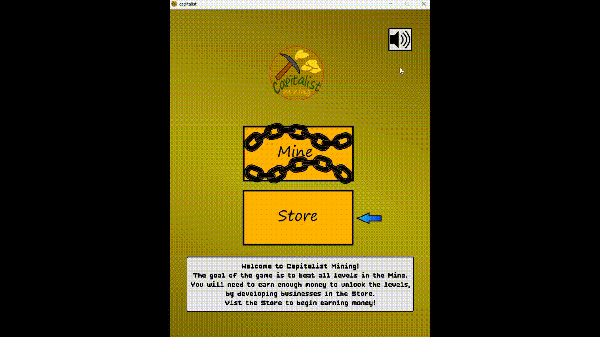
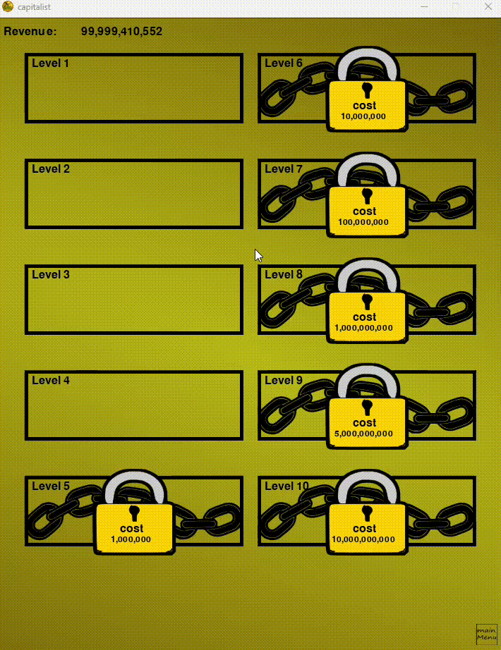

This is a game created with the pygame python library. This game combines an idle-clicker with a 2D platformer. The goal of the game is to beat all 10 levels in the "Mine", which are unlocked by earning money in the "Store".

To play the game, visit the live website:

https://andrewely8.github.io/CapitalistMining/build/web/index.html

The python code is ran in the browser using the pygbag library.

To run locally,

1. Clone the repository:

   git clone `https://github.com/andrewely8/CapitalistMining`

   cd CapitalistMining/CapitalistMining

2. Required dependencies (Python3, pygame 2.6.1+)

   pip install pygame

3. Run the game (main.py)

   python main.py
chrome

🎮 Gameplay (The game runs smoothly at 60 fps, the following are GIFs with reduced frame rate.)

